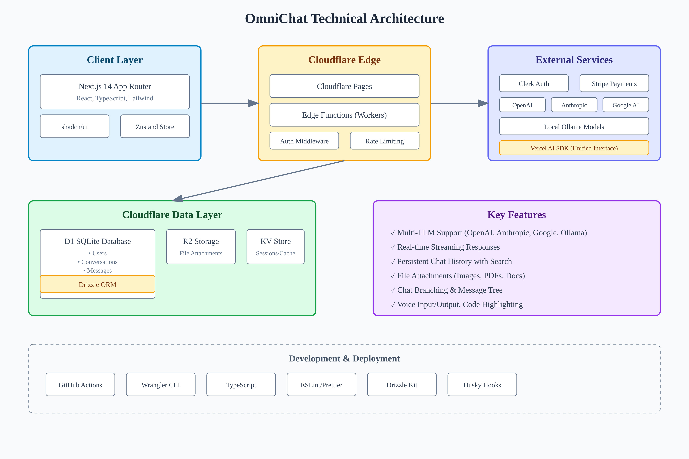

# OmniChat

AI chat application featuring multi-LLM support, local Ollama integration, and advanced chat features.

## 🏗️ Architecture



OmniChat is built on Cloudflare's edge infrastructure for global low-latency performance. The application leverages a modern stack with Next.js for the frontend, Cloudflare Workers for edge computing, and D1 SQLite for data persistence.

## Features

### Core Features

- **Multi-LLM Support**: Chat with OpenAI, Anthropic, Google Gemini, and local Ollama models
- **Local AI with Ollama**: Run models locally for privacy and offline use
- **Real-time Streaming**: Fast, responsive AI conversations with streaming responses
- **Persistent Chat History**: Save and search through your conversation history
- **Responsive Design**: Works seamlessly across desktop and mobile devices
- **Dark/Light Mode**: Toggle between themes for comfortable usage

### Advanced Features

- **File Attachments**: Upload and discuss images, PDFs, and documents
- **Code Syntax Highlighting**: Beautiful code blocks with language detection
- **Chat Branching**: Explore different conversation paths
- **Voice Input/Output**: Speak to AI and hear responses back
- **Resumable Streams**: Continue interrupted conversations seamlessly
- **Export Conversations**: Download chats as JSON or Markdown

## Tech Stack

- **Frontend**: Next.js 14+ with App Router and TypeScript
- **Backend**: Cloudflare Workers for edge functions
- **Database**: Cloudflare D1 (SQLite) with Drizzle ORM
- **Storage**: Cloudflare R2 for file attachments
- **Authentication**: Clerk for user management
- **Payments**: Stripe integration for subscriptions
- **Deployment**: Cloudflare Pages
- **UI**: Tailwind CSS with shadcn/ui components
- **AI Integration**: Vercel AI SDK for unified LLM interface & Ollama

## Getting Started

### Prerequisites

- Node.js 18+
- Cloudflare account (for deployment)
- API keys for AI providers (OpenAI, Anthropic, etc.)

### Development

```bash
# Install dependencies
npm install

# Start development server
npm run dev

# Run type checking
npm run typecheck

# Run linting
npm run lint
```

### CI/CD & Deployment

The project includes GitHub Actions for automatic deployment to Cloudflare Pages. See [Cloudflare CI Setup Guide](docs/cloudflare-ci-setup.md) for configuration instructions.

### Local Ollama Integration

OmniChat supports running AI models locally through Ollama, providing fast, private, and offline-capable AI conversations.

#### Quick Setup

1. **Install Ollama**

   ```bash
   # macOS/Linux
   curl -fsSL https://ollama.com/install.sh | sh

   # Windows
   # Download from https://ollama.com/download
   ```

2. **Enable CORS for Browser Access**

   ```bash
   # Start Ollama with CORS enabled
   OLLAMA_ORIGINS="*" ollama serve

   # Or set it permanently (Linux/macOS)
   # Add to ~/.bashrc or ~/.zshrc:
   export OLLAMA_ORIGINS="*"
   ```

3. **Pull AI Models**

   ```bash
   # Popular models
   ollama pull llama3.2        # 2GB, fast general purpose
   ollama pull mistral         # 4GB, good for coding
   ollama pull gemma3:27b      # 17GB, high quality
   ollama pull devstral        # 14GB, specialized for development

   # List installed models
   ollama list
   ```

4. **Configure in OmniChat**
   - Go to Profile → API Configuration
   - Ollama URL should be `http://localhost:11434` (default)
   - The app will automatically detect and list your installed models

#### Features

- **Direct Browser Connection**: Ollama models run directly from your browser to your local Ollama server
- **Automatic Model Detection**: Available models appear in the model selector
- **No Internet Required**: Once models are downloaded, works completely offline
- **Fast Response Times**: No network latency for local models
- **Privacy**: Your conversations never leave your machine

#### Troubleshooting

If Ollama models don't appear:

- Ensure Ollama is running: `ollama serve`
- Check CORS is enabled: The browser console should not show CORS errors
- Verify the URL in settings matches your Ollama instance
- Try accessing `http://localhost:11434/api/tags` in your browser

### Deployment

```bash
# Deploy to Cloudflare Pages
wrangler deploy

# Set up environment variables
wrangler secret put OPENAI_API_KEY
wrangler secret put ANTHROPIC_API_KEY
wrangler secret put CLERK_SECRET_KEY
```

## Environment Variables

Set these using `wrangler secret put <KEY>`:

- `OPENAI_API_KEY` - OpenAI API key
- `ANTHROPIC_API_KEY` - Anthropic API key
- `GOOGLE_AI_API_KEY` - Google AI API key
- `CLERK_SECRET_KEY` - Clerk authentication
- `STRIPE_SECRET_KEY` - Stripe payments

## Project Structure

```
src/
├── app/                 # Next.js App Router pages
├── components/          # React components
│   ├── chat/           # Chat-specific components
│   ├── layout/         # Layout components
│   └── ui/             # Reusable UI components
├── hooks/              # Custom React hooks
├── lib/                # Utilities and configurations
├── services/           # External service integrations
├── store/              # State management
└── types/              # TypeScript type definitions
```

## Contributing

1. Fork the repository
2. Create a feature branch: `git checkout -b feature/amazing-feature`
3. Make your changes and test them
4. Run `npm run typecheck` and `npm run lint`
5. Commit your changes: `git commit -m 'Add amazing feature'`
6. Push to the branch: `git push origin feature/amazing-feature`
7. Open a Pull Request

## License

This project is licensed under the MIT License - see the [LICENSE](LICENSE) file for details.
