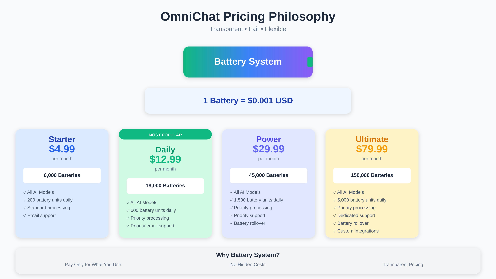

# 🚀 OmniChat - The Ultimate AI Conversation Platform

<div align="center">
  
  
  <h3>One Platform. All AI Models. Unlimited Possibilities.</h3>
  
  [](https://developers.cloudflare.com/pages)
  [](https://nextjs.org)
  [](https://www.typescriptlang.org)
  [](LICENSE)
  
  <p align="center">
    <a href="#-why-omnichat">Why OmniChat</a> •
    <a href="#-features">Features</a> •
    <a href="#-live-demo">Demo</a> •
    <a href="#-quick-start">Quick Start</a> •
    <a href="#-pricing">Pricing</a> •
    <a href="#-tech-stack">Tech Stack</a>
  </p>
</div>

---

## 🌟 Why OmniChat?

In a world of fragmented AI services, **OmniChat** stands as the unified solution. No more juggling multiple subscriptions, managing different interfaces, or losing conversation history across platforms.

### 🎯 The Problem OmniChat Solves

- **AI Fatigue**: Too many AI platforms, each with their own subscription
- **Context Loss**: Switching between models means losing your conversation flow
- **Hidden Costs**: Surprise bills from unclear pricing models
- **Feature Gaps**: Each platform has strengths, but you need them all

### 💡 Our Solution

**One platform that speaks to all AIs** - with transparent pay-per-use pricing, seamless model switching, and powerful features that amplify your productivity.

<div align="center">
  
</div>

---

## ✨ Features

### 🤖 **Multi-LLM Support**

Access the world's most powerful AI models in one place:

- **OpenAI**: GPT-4, DALL-E 2/3
- **Anthropic**: Claude Opus, Sonnet, Haiku
- **Google**: Gemini Pro, Gemini Flash
- **xAI**: Grok models
- **DeepSeek**: Advanced reasoning models
- **Local AI**: Ollama integration for privacy-first users

### 🔄 **Seamless Model Switching**

Switch between AI models mid-conversation without losing context. Compare responses from different models side-by-side.

### 📎 **Advanced File Support**

- Upload PDFs, images, documents, and code files
- AI analyzes and references your files in context
- Support for multiple file types in a single conversation

### 🌿 **Conversation Branching**

Create alternate conversation paths to explore different approaches without losing your original thread.

### 📚 **Smart Templates**

15+ pre-built conversation templates for:

- Code generation and debugging
- Content writing and editing
- Data analysis and visualization
- Creative brainstorming
- Business planning

### 💰 **Transparent Battery System**

Our revolutionary pricing model: **1 Battery = $0.001**

- See exactly what each message costs
- No hidden fees or surprise charges
- Pay only for what you use

<div align="center">
  
</div>

---

## 🚀 Quick Start

### Prerequisites

- Node.js 18+ and npm
- Cloudflare account (free tier works)
- Stripe account for payments
- Clerk account for authentication

### 1. Clone and Install

```bash
git clone https://github.com/yourusername/omnichat.git
cd omnichat
npm install
```

### 2. Set Up Cloudflare

```bash
# Install Wrangler CLI
npm install -g wrangler

# Login to Cloudflare
wrangler login

# Create D1 Database
wrangler d1 create omnichat-db

# Create R2 Bucket
wrangler r2 bucket create omnichat-uploads
```

### 3. Configure Environment

```bash
# Set up secrets
wrangler secret put CLERK_SECRET_KEY
wrangler secret put STRIPE_SECRET_KEY
wrangler secret put STRIPE_WEBHOOK_SECRET

# Optional: Add your own API keys
wrangler secret put OPENAI_API_KEY
wrangler secret put ANTHROPIC_API_KEY
```

### 4. Initialize Database

```bash
# Set your D1 database ID
export D1_DATABASE_ID=your-database-id-here

# Run migrations
npm run db:migrate:prod
```

### 5. Deploy

```bash
# Deploy to Cloudflare Pages
wrangler pages deploy
```

### 6. Local Development

```bash
# Start development server
npm run dev

# Open http://localhost:3000
```

---

## 💳 Pricing

<div align="center">
  
| Plan | Monthly Price | Batteries | Daily Limit | Best For |
|------|--------------|-----------|-------------|----------|
| **Starter** | $4.99 | 6,000 | 200 | Personal use, trying out AI |
| **Daily** ⭐ | $12.99 | 18,000 | 600 | Regular users, students |
| **Power** | $29.99 | 45,000 | 1,500 | Professionals, teams |
| **Ultimate** | $79.99 | 150,000 | 5,000 | Enterprises, heavy users |

</div>

### Why Batteries?

- **Transparent**: Know exactly what each query costs
- **Flexible**: Use any model without separate subscriptions
- **Fair**: Only pay for actual usage, not idle time
- **Simple**: One currency across all AI models

---

## 🛠 Tech Stack

<div align="center">
  
</div>

### Frontend

- **Next.js 15**: React framework with App Router
- **React 19**: Latest React features
- **TypeScript 5**: Type-safe development
- **Tailwind CSS 4**: Utility-first styling
- **shadcn/ui**: Beautiful, accessible components
- **Zustand**: Lightweight state management

### Backend & Infrastructure

- **Cloudflare Workers**: Edge computing runtime
- **Cloudflare D1**: Serverless SQL database
- **Cloudflare R2**: Object storage for files
- **Drizzle ORM**: Type-safe database queries
- **Clerk**: Authentication and user management
- **Stripe**: Payment processing

### AI Integrations

- OpenAI SDK
- Anthropic SDK
- Google Generative AI
- xAI SDK
- DeepSeek SDK
- Ollama for local models

---

## 📁 Project Structure

```
omnichat/
├── src/
│   ├── app/              # Next.js App Router pages
│   ├── components/       # React components
│   │   ├── chat/        # Chat-specific components
│   │   ├── layout/      # Layout components
│   │   └── ui/          # Reusable UI components
│   ├── hooks/           # Custom React hooks
│   ├── lib/             # Utilities and configs
│   ├── services/        # External service integrations
│   ├── store/           # Zustand state management
│   └── types/           # TypeScript type definitions
├── docs/                # Documentation and images
├── scripts/             # Build and deployment scripts
└── tests/               # Test suites
```

---

## 🔒 Security & Privacy

### Local AI Option

Run models locally with Ollama integration for complete privacy and data control.

---

## 🌍 Performance

### Global Edge Network

- **300+ Points of Presence** worldwide
- **<50ms latency** for 99% of users
- **99.99% uptime** SLA
- **Auto-scaling** for demand spikes

### Optimizations

- Server-side rendering for instant loads
- Streaming responses for real-time feel
- Intelligent caching strategies
- Progressive enhancement

---

## 🤝 Contributing

See the [Contributing Guide](CONTRIBUTING.md) for details.

### Development Workflow

1. Fork the repository
2. Create a feature branch (`git checkout -b feature/amazing-feature`)
3. Commit your changes (`git commit -m 'Add amazing feature'`)
4. Push to the branch (`git push origin feature/amazing-feature`)
5. Open a Pull Request

---

## 📄 License

This project is licensed under the MIT License - see the [LICENSE](LICENSE) file for details.

---

